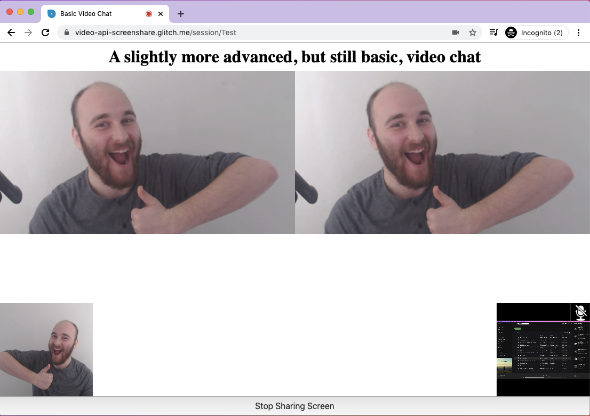

# Screensharing with the Vonage Video API

## Set Up

1. Remix this project
2. Sign up for a [Vonage Video API account](https://tokbox.com/account/user/signup)
3. Put your API credentials in `🔑.env`
4. Click _Show_ at the top of this editor

## Contributing
We :heart: contributions from everyone! Check out the [Contributing Guidelines][contributing] for more information.

[![contributions welcome][contribadge]][issues]

## License

This project is subject to the [MIT License][license]

[contribadge]: https://img.shields.io/badge/contributions-welcome-brightgreen.svg?style=flat "Contributions Welcome"

[coc]: CODE_OF_CONDUCT.md "Code of Conduct"
[contributing]: CONTRIBUTING.md "Contributing"
[license]: LICENSE "MIT License"

[issues]: ./../../issues "Issues"
